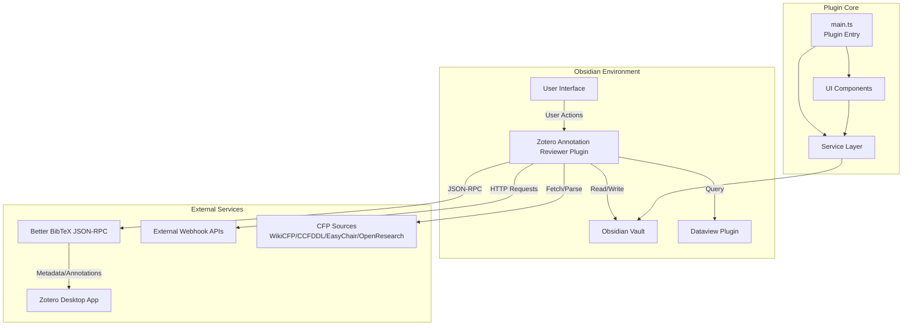
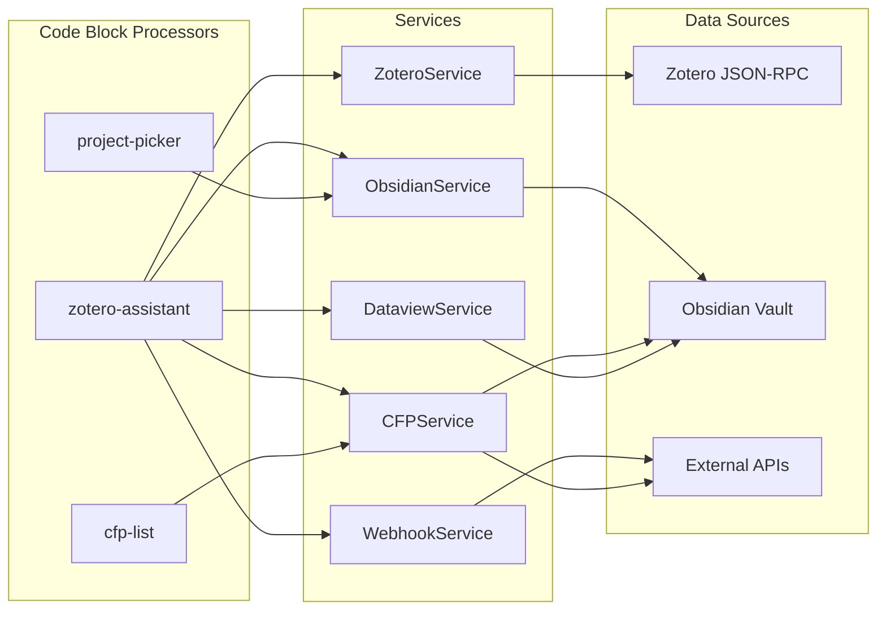
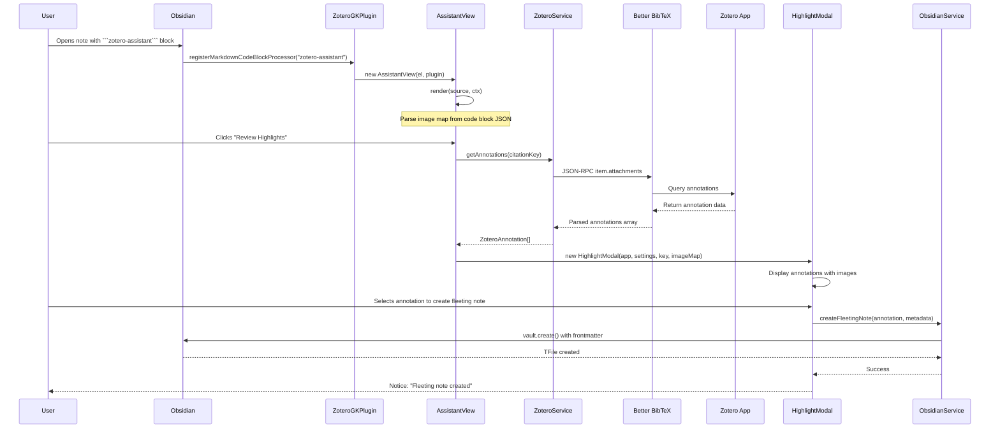
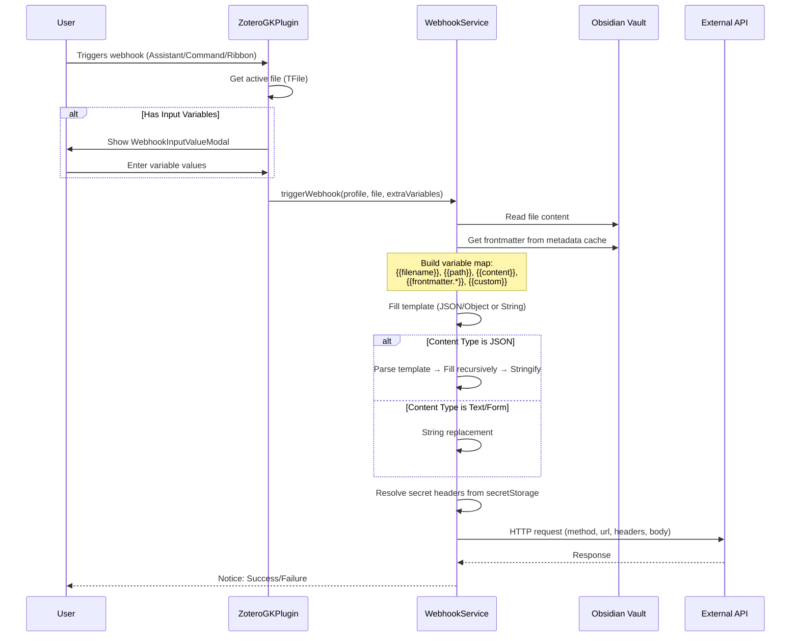

# Architecture & Code Structure

This document describes the architecture, code organization, and data flow of the Zotero Annotation Reviewer plugin.

---

## File Structure

```
zotero-annotation-reviewer/
├── src/
│   ├── main.ts                    # Plugin entry point, registers code blocks and commands
│   ├── types.ts                   # TypeScript interfaces and type definitions
│   ├── settings.ts                # Settings UI with CodeMirror editors
│   ├── styles.css                 # Plugin-specific CSS styles
│   │
│   ├── services/                  # Core business logic services
│   │   ├── zotero.ts             # Zotero JSON-RPC communication via Better BibTeX
│   │   ├── zotero-connector.ts   # Integration with Zotero Integration plugin
│   │   ├── obsidian.ts            # Obsidian vault/file operations
│   │   ├── dataview.ts           # Dataview plugin integration
│   │   ├── webhook.ts             # Webhook HTTP request handling
│   │   ├── cfp.ts                 # CFP service orchestrator
│   │   ├── cfp-wikicfp.ts         # WikiCFP parser
│   │   ├── cfp-wikicfp-series.ts  # WikiCFP Series index parser
│   │   ├── cfp-ccfddl.ts          # CCFDDL YAML parser
│   │   ├── cfp-easychair.ts       # EasyChair parser
│   │   └── cfp-openresearch.ts    # OpenResearch parser
│   │
│   ├── ui/                        # User interface components
│   │   ├── assistant.ts          # Main zotero-assistant code block renderer
│   │   ├── highlights.ts          # Highlight review modal
│   │   ├── project-selector.ts   # project-picker code block renderer
│   │   ├── cfp-list-view.ts      # cfp-list code block renderer
│   │   ├── cfp-list-modal.ts     # CFP list display modal
│   │   ├── cfp-manual-modal.ts   # Manual CFP creation modal
│   │   └── inputs.ts              # Shared input components
│   │
│   └── utils/                     # Utility functions
│       ├── parser.ts             # JSON/image map parsing
│       └── series.ts             # Series name extraction utilities
│
├── __mocks__/
│   └── obsidian.ts               # Jest mocks for Obsidian API
│
├── docs/                         # Documentation
│   ├── requirements-*.md        # Feature requirement documents
│   └── assets/                   # PlantUML diagrams
│
├── esbuild.config.mjs            # Build configuration
├── jest.config.js                # Test configuration
├── tsconfig.json                 # TypeScript configuration
├── package.json                  # Dependencies and scripts
└── manifest.json                 # Obsidian plugin manifest
```

---

## System Architecture

### High-Level Architecture Flow



### Component Interaction Flow



---

## Data Flow

### Critical User Interaction: Reviewing Annotations



### Webhook Triggering Flow



---

## Key Modules

### 1. Main Plugin (`src/main.ts`)

**Responsibility:** Plugin lifecycle management, code block registration, command registration.

**Key Functions:**
- `onload()` - Initializes services, registers code block processors, adds commands
- `onunload()` - Cleanup (removes window API)
- `updateWebhookRibbonIcon()` - Manages sidebar ribbon icon visibility

**Dependencies:** All services, UI components

---

### 2. ZoteroService (`src/services/zotero.ts`)

**Responsibility:** Communication with Zotero via Better BibTeX JSON-RPC.

**Key Methods:**
- `getItemMetadata(citationKey)` - Fetch paper metadata
- `getAnnotations(citationKey)` - Fetch all annotations (highlights, images, notes)
- `sendRpc(method, params)` - Low-level JSON-RPC call

**Data Flow:**
```
ZoteroService → Better BibTeX (port 23119) → Zotero Desktop → Returns JSON
```

---

### 3. WebhookService (`src/services/webhook.ts`)

**Responsibility:** HTTP webhook execution with template variable substitution.

**Key Methods:**
- `triggerWebhook(profile, file, extraVariables)` - Execute webhook request
- `fillTemplateRecursive(obj, variables)` - Recursive JSON object template filling
- `fillStringTemplate(template, variables, escapeJson)` - String template replacement

**Template Variables:**
- `{{filename}}`, `{{path}}`, `{{content}}`, `{{timestamp}}`
- `{{frontmatter.KEY}}` - Any frontmatter field
- `{{custom}}` - User-defined input variables

---

### 4. CFPService (`src/services/cfp.ts`)

**Responsibility:** Orchestrates CFP fetching, parsing, and note creation from multiple sources.

**Key Methods:**
- `refresh()` - Refresh all URL sources (WikiCFP, CCFDDL, EasyChair, OpenResearch)
- `refreshWikiCFPSeries()` - Scan WikiCFP Series index (A-Z)
- `refreshSeriesByUrl(programUrl, seriesAcronym)` - Refresh events for a specific series
- `saveManualCFP(item)` - Create CFP note from manual input
- `findBestMatchingCFPForConference(note)` - Match conference notes to CFP events

**Sub-services:**
- `cfp-wikicfp.ts` - WikiCFP HTML parsing
- `cfp-wikicfp-series.ts` - Series index and event table parsing
- `cfp-ccfddl.ts` - CCFDDL YAML parsing
- `cfp-easychair.ts` - EasyChair HTML parsing
- `cfp-openresearch.ts` - OpenResearch HTML parsing

---

### 5. AssistantView (`src/ui/assistant.ts`)

**Responsibility:** Renders the `zotero-assistant` code block as an interactive dashboard.

**Key Features:**
- Displays metadata (title, authors, venue, year)
- Shows action buttons (Update Metadata, Review Highlights, Webhooks)
- Renders local highlights via DataviewJS script
- Displays CFP context section with matching conference information

**Rendering Flow:**
1. Parse image map from code block JSON
2. Extract citation key from note frontmatter
3. Render header with metadata
4. Render action buttons
5. Execute DataviewJS script for local highlights
6. Query CFP service for conference match
7. Render CFP context section

---

### 6. ObsidianService (`src/services/obsidian.ts`)

**Responsibility:** Obsidian vault operations (file creation, frontmatter manipulation).

**Key Methods:**
- `createFleetingNote(annotation, metadata)` - Create atomic note from annotation
- `updateFrontmatter(file, key, value)` - Modify note frontmatter
- `ensureFolder(path)` - Create folder if missing

---

### 7. DataviewService (`src/services/dataview.ts`)

**Responsibility:** Integration with Dataview plugin for querying notes.

**Key Methods:**
- `isAvailable` - Check if Dataview is installed
- `executeDataviewJS(code, container, file)` - Execute DataviewJS code in safe context

---

## Data Structures

### Core Types (`src/types.ts`)

**ZoteroAnnotation:**
```typescript
{
  key: string;
  citationKey: string;
  type: 'highlight' | 'image' | 'ink' | 'note' | 'unknown';
  text: string;
  comment: string;
  color: string;
  pageLabel: string;
  link: string;
  attachmentTitle: string;
  date: string;
  position?: any;
}
```

**WebhookProfile:**
```typescript
{
  id: string;
  name: string;
  icon: string;
  url: string;
  method: 'GET' | 'POST' | 'PUT' | 'DELETE';
  headers: WebhookHeader[];
  bodyTemplate: string;
  hidden: boolean;
  contentType: 'json' | 'form' | 'text';
  inputVariables?: WebhookInputVariable[];
}
```

**CFPItem:**
```typescript
{
  acronym: string;
  series?: string;
  fullName: string;
  location: string;
  start?: string;
  end?: string;
  submissionDdl: string;
  source: CFPSource;
  url?: string;
}
```

---

## Settings Management

Settings are stored in Obsidian's plugin data directory and loaded via `loadData()`. The `MyPluginSettings` interface defines all configurable options:

- **General:** Zotero port, fleeting notes folder, citation/annotation key names
- **Projects:** Projects folder, frontmatter keys
- **Webhooks:** Array of webhook profiles
- **CFP:** Folder, tags, URLs, refresh intervals, Series index letters, DataviewJS code

Settings UI is implemented in `src/settings.ts` with tabbed interface and CodeMirror editors for JSON/JavaScript templates.

---

## Build Process

1. **TypeScript Compilation:** `tsc -noEmit` (type checking only)
2. **Bundling:** `esbuild` bundles `src/main.ts` and `src/styles.css`
3. **Output:** `main.js` and `styles.css` in plugin root
4. **External Dependencies:** Obsidian API, CodeMirror, and Node built-ins are marked as external

---

## Testing Architecture

- **Test Framework:** Jest with ts-jest transformer
- **Environment:** jsdom (for DOM APIs)
- **Mocks:** `__mocks__/obsidian.ts` provides mock Obsidian API
- **Coverage:** Targets 75% statements, 55% branches, 85% functions, 80% lines
- **Test Files:** `*.test.ts` alongside source files

---

## Extension Points

### Code Block Processors
- `zotero-assistant` - Main annotation review dashboard
- `project-picker` - Project linking UI
- `cfp-list` - CFP list display

### Commands
- `zotero-trigger-webhook` - Trigger webhook from command palette
- `cfp-refresh` - Refresh CFP sources
- `cfp-add-manual` - Add manual CFP
- `cfp-show-list` - Show CFP list modal
- `cfp-refresh-wikicfp-series` - Refresh WikiCFP Series index
- `cfp-refresh-this-series` - Refresh specific series (from Series note)

### Window API
- `window.__ZoteroAnnotationReviewerCFP.refreshSeries(programUrl, seriesAcronym)` - Exposed for DataviewJS integration

---

## Security Considerations

1. **Webhook Headers:** Secrets stored in Obsidian `secretStorage`, not plain text
2. **Template Injection:** JSON templates use recursive object filling (safer than string replacement)
3. **File Paths:** All paths normalized and sanitized before file operations
4. **External Requests:** Rate limiting and delays for CFP sources to avoid crawler detection
